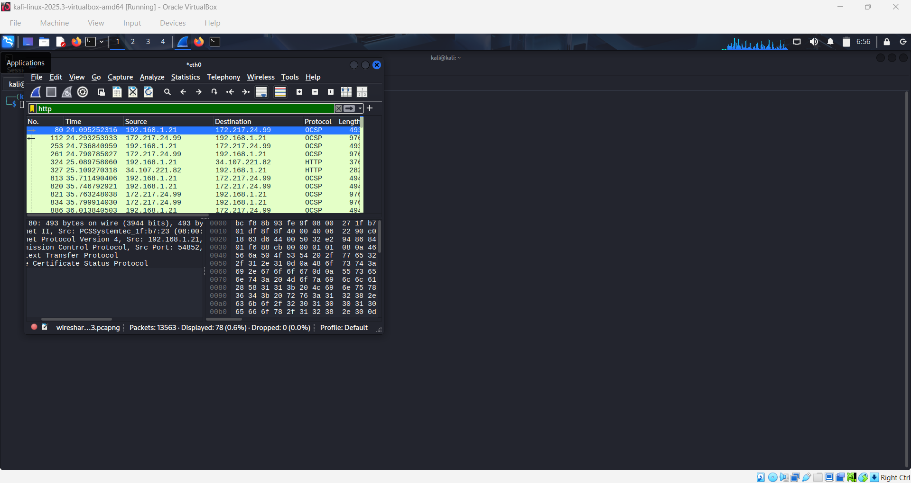
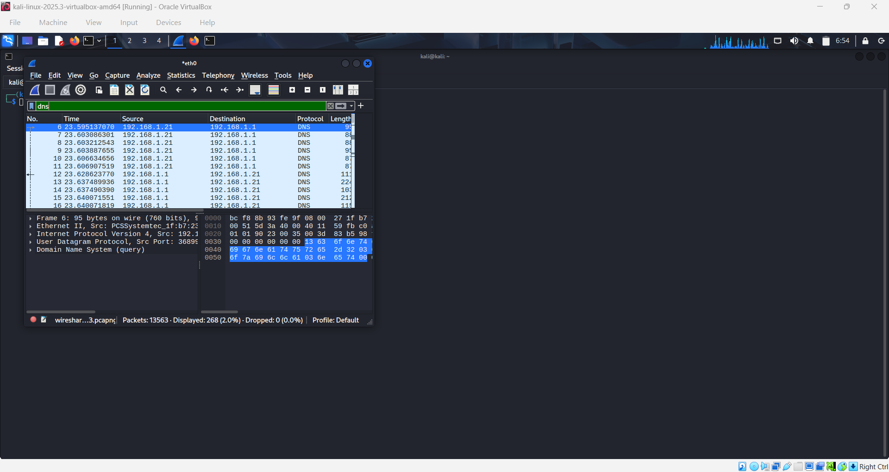
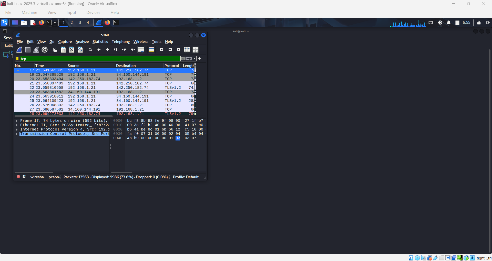
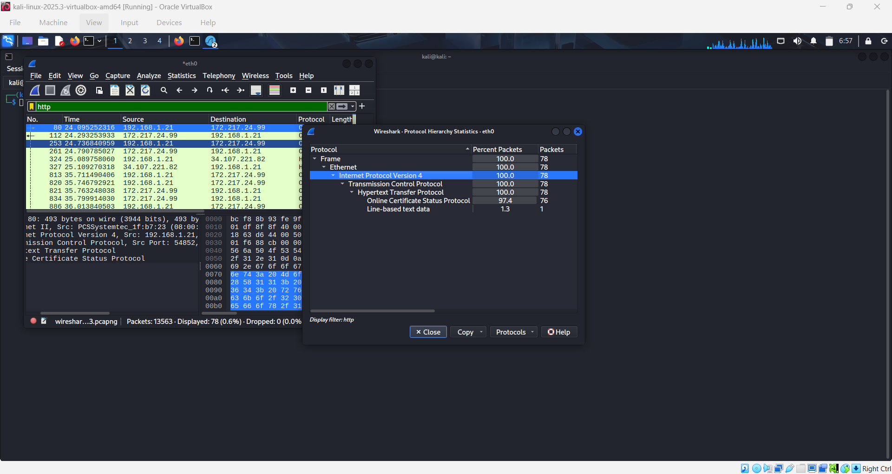
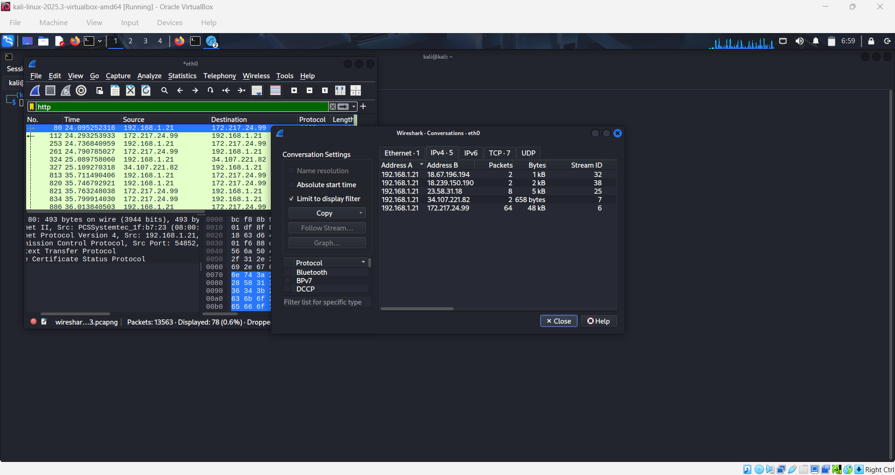

# Wireshark Network Traffic Analysis

Security project demonstrating network packet analysis using Wireshark on Kali Linux.

---

## Project Objective

The goal of this project is to capture and analyze network traffic using Wireshark to understand how different protocols communicate across a network.

The project focuses on analyzing:

- DNS traffic
- HTTP traffic
- TCP communication
- Protocol hierarchy statistics
- Network conversations between IP addresses

---

## Tools Used

- Wireshark
- Kali Linux
- VirtualBox

---

## Filters Used During Analysis

DNS Filter

dns

HTTP Filter

http

TCP Filter

tcp

These filters were used to isolate specific network traffic for analysis.

---

## Protocol Analysis

The **Protocol Hierarchy Statistics** feature in Wireshark was used to analyze protocol distribution within the captured packets.

Example hierarchy observed:

Ethernet → IPv4 → TCP → HTTP

This helps analysts understand which protocols dominate network traffic.

---

## Network Conversations

The **Conversations feature** in Wireshark was used to analyze communication between IP addresses.

It helps identify:

- Source IP address
- Destination IP address
- Number of packets exchanged
- Amount of data transferred

This technique is commonly used in cybersecurity investigations to identify suspicious communication.

---

## Screenshots

### HTTP Traffic

### DNS Traffic

### TCP Traffic

### Protocol Hierarchy

### Network Conversations

---

## Skills Demonstrated

- Network traffic analysis
- Packet filtering using Wireshark
- DNS query investigation
- TCP communication analysis
- Protocol hierarchy analysis
- Network conversation monitoring
- Basic incident investigation techniques

---
